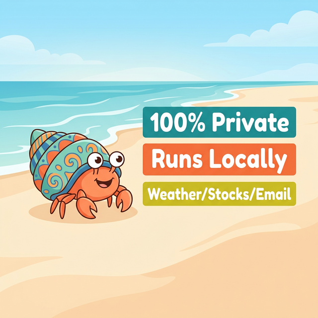

# 🦀 Hermit Crab



A local-first AI assistant with extensible tools, adaptive reasoning, and full privacy control. Runs entirely on your machine. Your data never leaves.

## Why Hermit Crab?

- **100% Private:** No cloud APIs. No telemetry. Your voice, questions, and habits stay on your machine.
- **Transparent:** Single-file backend and frontend. The tools use standard, auditable APIs so there are no hidden network calls.
- **Infinitely Extensible:** Just drop a Python file in `tools/` and restart. No complex config or approval process.
- **Adaptive Thinking:** Simple queries get instant answers. Complex tasks get deep reasoning models. Fast and smart where it matters.

## Built-In Tools

☀️ **Daily Brief** • 📈 **Stocks** • ✉️ **Gmail** • 📅 **Calendar** • ✈️ **Trips** • 🎵 **Music** 
🌤️ **Weather** • 💡 **Smart Home** • ✅ **Reminders** • 📝 **Notes** • 📄 **Summarize** • 💬 **Messaging**

*The Daily Brief uniquely pulls weather, stocks, emails, and trips into a single parallelized interactive card!*

## Get Started

```bash
./setup.sh          # Installs Ollama, Python deps, and Whisper model
./run.sh            # Starts Ollama + Web server
open http://localhost:8765
```

See [SETUP.md](SETUP.md) for details on Google OAuth (Gmail, Calendar, Trips) and advanced configurations.
